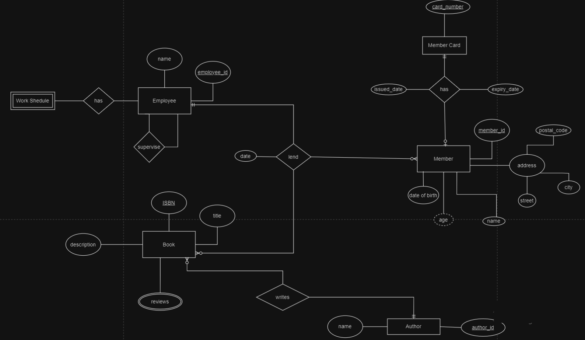
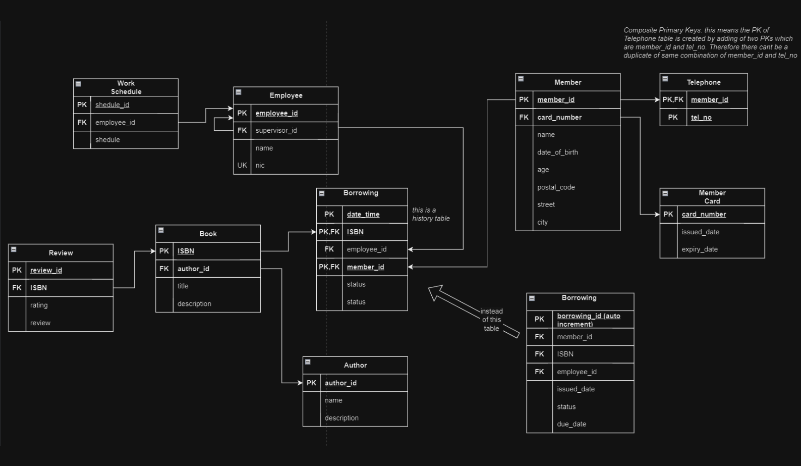

# Library Management System

## Project Description

The Library Management System is a database project designed to manage the records of books, authors, members, librarians, and loan transactions in a library. This project includes an Entity-Relationship Diagram (ERD), mapping of entities to tables, SQL scripts to create the database, and normalization to ensure data integrity and efficiency.

## Features

- Manage books and their details such as title, author, genre, published year, ISBN, and copies.
- Maintain records of authors with their biography.
- Track members and their contact information along with membership dates.
- Record loan transactions including loan date, return date, and due date.
- Keep a record of librarians and their contact information.
- Ensure data normalization to eliminate redundancy and improve database efficiency.

## ERD (Entity-Relationship Diagram)




## Description

The Library Management System includes an Entity-Relationship Diagram (ERD), mapping of entities to tables, SQL scripts to create the database, and normalization to ensure data integrity and efficiency.

## Normalization

The database design ensures:

- **First Normal Form (1NF)**: All tables have primary keys, and each column contains atomic values.
- **Second Normal Form (2NF)**: All non-key attributes are fully functionally dependent on the primary key. There are no partial dependencies.
- **Third Normal Form (3NF)**: There are no transitive dependencies. Non-key attributes do not depend on other non-key attributes.

## Getting Started

### Prerequisites

- MySQL or any other SQL database management system.

### Installation

1. Clone the repository:
   ```sh
   git clone https://github.com/dilumsampath/database-library-management-system.git

2. Navigate to the project directory:

   cd database-library-management-system

3. Import the SQL script into your database management system to create the database and tables.

## Usage

Run the SQL scripts to set up the database.
Use your preferred SQL client to interact with the database.

## Repository Structure

.gitignore: Specifies files and directories to be ignored by git.
data.sql: Contains sample data for the database.
delete.sql: SQL script to delete data from the database.
Library Management System.drawio: Diagram file for the ERD.
notes.txt: Miscellaneous notes related to the project.
others.sql: Additional SQL scripts for various operations.
readme.md: This README file.
retrieve.sql: SQL script to retrieve data from the database.
tables.sql: SQL script to create the database tables.
update.sql: SQL script to update data in the database.
images/: Directory containing ERD and mapped tables images.
ERD.png: Image file of the Entity-Relationship Diagram.
Mapped_Tables.png: Image file of the mapped tables.

## Contributing

Contributions are welcome! Please fork the repository and submit a pull request with your changes.

## License
This project is licensed under the MIT License.

## Contact
LinkedIn Profile: https://www.linkedin.com/in/dilum-sampath-77ba83203/ 


